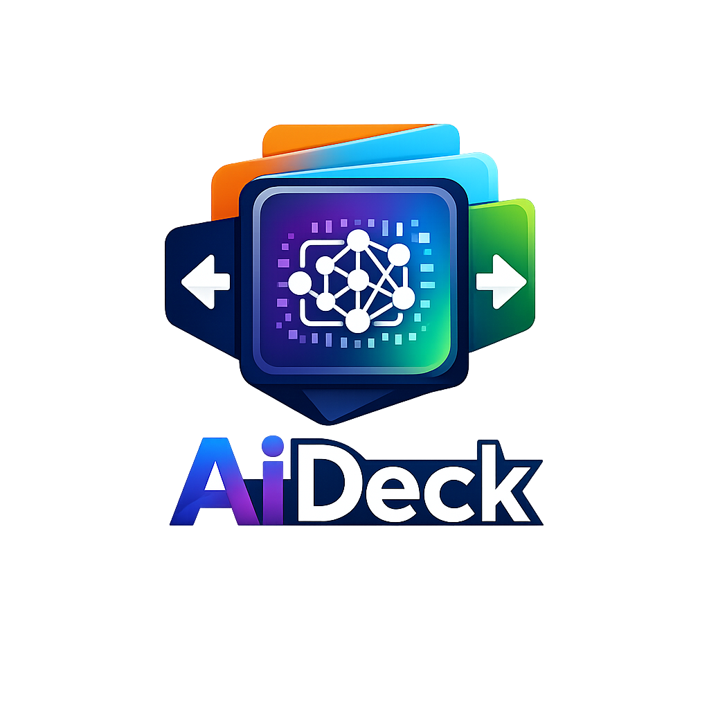

<p align="center">
  
</p>

<h1 align="center">AiDeck</h1>

<p align="center">
  
  
</p>

<p align="center">
  <strong>AI IDE 多平台多账号管理工具</strong>
</p>

<p align="left">
  &nbsp;&nbsp;&nbsp;&nbsp;&nbsp;&nbsp;&nbsp;&nbsp;AiDeck 是一个面向桌面场景的本地管理工具，用于统一管理 Antigravity、Codex、Gemini CLI 等平台账号,
  提供本地导入、账号切换、配额查看、标签整理与导出等能力。
</p>

---

AiDeck 是一个面向本地桌面场景的 AI IDE 多平台多账号看板，当前适配 `Antigravity`、`Codex`、`Gemini CLI`。

项目现在同时支持两种宿主：

## 仓库结构

```text
Aideck/
├── apps/
│   ├── utools/      # uTools 插件壳
│   └── desktop/     # Electron 桌面壳
├── packages/
│   ├── app-shell/   # 主应用 UI 与共享页面
│   ├── core/        # HostBridge 契约与桥接装配
│   ├── infra-node/  # 文件存储、日志、设置、HTTP、revision
│   └── platforms/   # Antigravity / Codex / Gemini 平台实现
├── public/          # uTools 静态资源与 preload wrapper
└── tests/           # Node test
```

## 数据目录

AiDeck 的主数据目录统一放在用户主目录下的 `.ai_deck`：

- macOS / Linux: `~/.ai_deck`
- Windows: `%USERPROFILE%\\.ai_deck`

目录内部按职责分层：

```text
~/.ai_deck/
├── meta/
├── accounts/
│   ├── antigravity/
│   ├── codex/
│   └── gemini/
├── settings/
│   ├── shared.json
│   └── hosts/
├── logs/
├── sync/
└── cache/
```

说明：

- 账号数据、当前账号、OAuth pending、共享业务设置都放在 `~/.ai_deck`
- `uTools` 与 `Electron` 在同机共享同一份数据
- 宿主专属偏好写入 `settings/hosts/{utools|desktop}.json`

## 存储后端策略

当前默认后端仍然是文件仓储：

当前这么做是为了保留：

- `~/.ai_deck` 可直接查看、备份、排障
- `uTools` / `Electron` 共享目录的兼容性
- 加密同步快照仍然导出为 JSON

文件仓储现在已经补了：

- 原子写入
- revision 总线
- 批次提交
- 目录级锁文件/写入租约

只有当规模或并发问题被真实证明后，才会再评估是否迁到数据库方案。

## 开发环境

要求：

- `Node.js >= 20`

安装依赖：

```bash
npm install
```

## 启动与构建

### uTools

开发：

```bash
npm run dev:utools
```

构建：

```bash
npm run build:utools
```

### Desktop

开发：

```bash
npm run dev:desktop
```

构建：

```bash
npm run build:desktop
```

按平台打包：

```bash
npm run build:desktop:mac
npm run build:desktop:win
npm run build:desktop:linux
```

说明：

- `macOS` 产物为 `dmg`
- `Windows` 产物为 `nsis`
- `Linux` 产物为 `AppImage`
- 打包命令应在对应操作系统或 CI 上执行，不做本机跨平台强行打包

### 全量构建

```bash
npm run build
```

### 测试

```bash
npm test
```

## HostBridge 边界

renderer 侧唯一宿主入口是 `window.hostBridge`，约定命名空间如下：

- `window.hostBridge.settings`
- `window.hostBridge.platforms`
- `window.hostBridge.host`
- `window.hostBridge.plugin`
- `window.hostBridge.logs`
- `window.hostBridge.events`
- `window.hostBridge.storage`
- `window.hostBridge.platform`

约束：

- renderer 不直接访问 `window.utools`
- renderer 不直接访问 `window.services`
- renderer 不直接访问 `dbStorage`

## 产物忽略

以下目录不会提交到 Git：

- `dist`
- `apps/desktop/dist-electron`
- `apps/desktop/dist-packages`

## CI

仓库内置 GitHub Actions：

- `test-and-build`：在 `macOS / Windows / Linux` 上跑 `npm test`、`build:utools`、`build:desktop`
- `package-desktop`：在对应系统上执行桌面端打包命令

其中 `package-desktop` 通过 `workflow_dispatch` 手动触发，避免在每个提交上重复打包安装产物。

## 安全说明

- 所有账号、Token、刷新凭证默认只落本地
- 同步能力当前基于加密快照，不依赖云端后端
- 非官方平台客户端或授权工具，使用风险需自行评估
