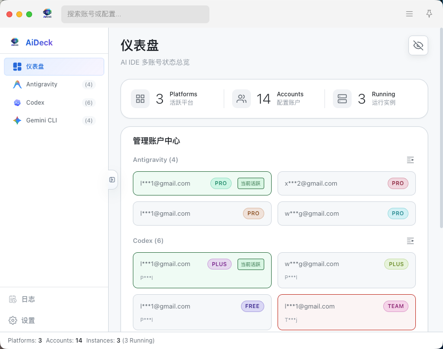
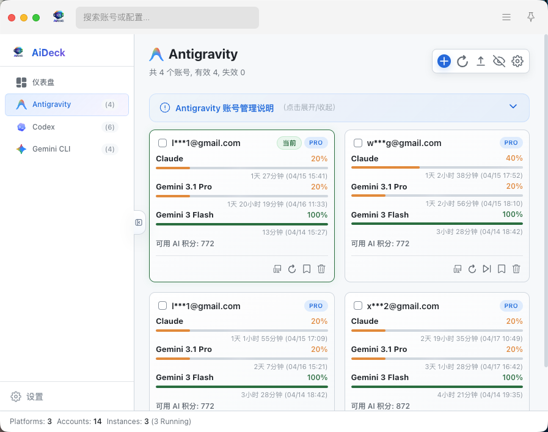
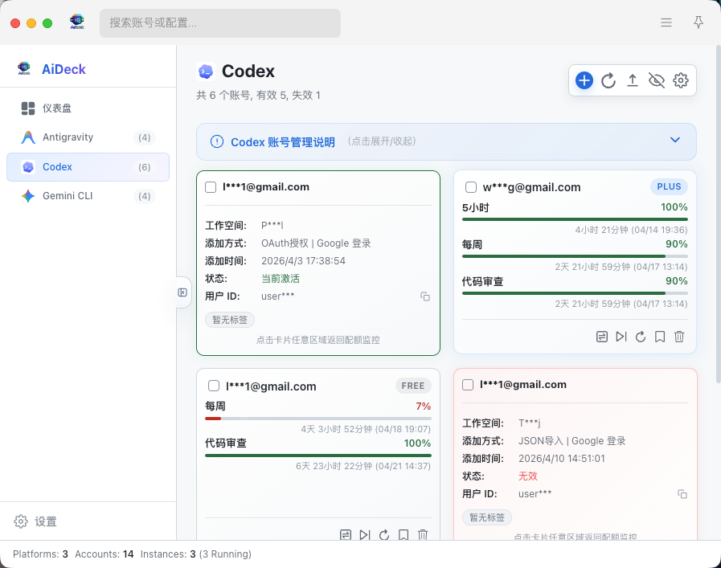
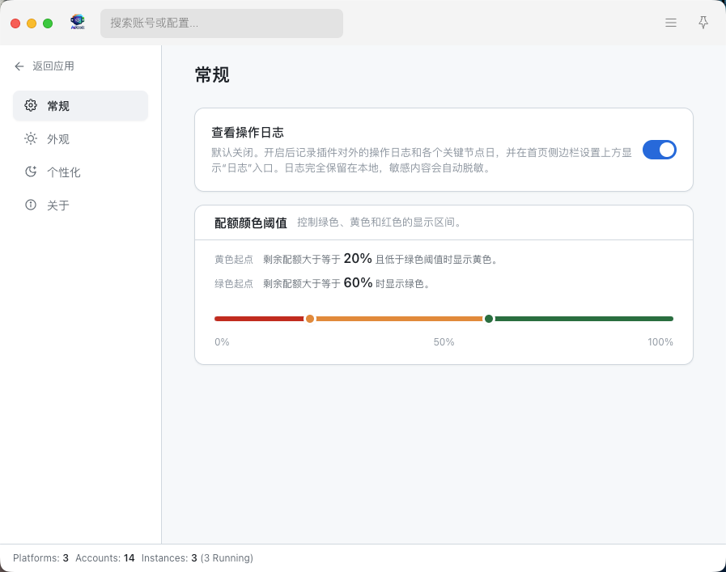
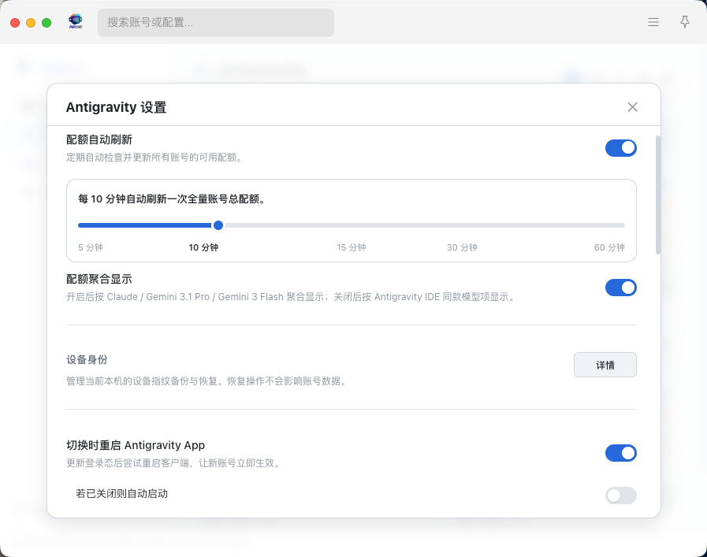

<p align="center">
  
</p>

<h1 align="center">AiDeck 🚀</h1>

<p align="center">
  
  
  
  
</p>

<p align="center">
  <strong>您的个人高性能 AI 账号调度中心</strong><br>
  不仅仅是账号管理，更是打破 API 调用壁垒的轻量化看板解决方案。
</p>

<p align="center">
  <a href="#-核心功能">核心功能</a> • 
  <a href="#-界面导览">界面导览</a> • 
  <a href="#-仓库结构">技术架构</a> • 
  <a href="#-启动与构建">安装指南</a> • 
  <a href="#-安全说明">安全声明</a>
</p>

---

## 📖 项目简介

**AiDeck** 是一个面向 uTools 的 AI IDE 多账号管理插件。它聚合 Antigravity、Codex、Gemini CLI 等账号能力，为您提供极速切换、配额监控及标签管理能力。

目前已完美适配以下平台：
- 🟢 **Antigravity** (IDE 后端)
- 🔵 **Codex** (OpenAI 协议)
- 🟣 **Gemini CLI** (Google AI)

---

## ✨ 核心功能

*   **🎛️ 智能账号仪表盘**：一目了然查看所有平台的账号状态、配额余量及有效期。
*   **⚡ 极速账号切换**：支持一键注入/热切当前活动账号，无需手动修改配置文件。
*   **📁 本地数据自治**：所有账户 Token、刷新凭证均落盘于本地，支持加密快照导出与同步。
*   **🏷️ 标签与组织**：通过标签系统对海量账号进行分类整理，支持批量导出管理。
*   **🛡️ 安全授权体系**：内置 OAuth 2.0 回调服务器重试机制，确保在复杂网络环境下依然能够稳定授权。

---

## 🖼️ 界面导览

<p align="center">
  
  
  
</p>
<p align="center">
  
  
</p>

---

## 🏗️ 仓库结构

项目采用轻量 Monorepo 架构，当前仅保留 uTools 单端宿主：

```text
Aideck/
├── 📱 apps/
│   └── utools/      # uTools 插件宿主
├── 📦 packages/
│   ├── app-shell/   # 核心渲染引擎 (React + Vanilla CSS)
│   ├── core/        # uTools HostBridge 桥接协议
│   ├── infra-node/  # 基础设施层 (原子写入存储、日志轮转)
│   └── platforms/   # 服务聚合层 (多平台具体实现)
├── 📂 docs/            # 截图与说明资源
└── 🧪 tests/           # 高覆盖率自动化测试
```

---

## 💾 数据目录

AiDeck 坚持“数据私有”原则，所有数据存储在用户主目录下的 `.ai_deck` 文件夹中：

- **macOS / Linux**: `~/.ai_deck`
- **Windows**: `%USERPROFILE%\.ai_deck`

> [!TIP]
> 当前项目只维护 uTools 插件端，数据目录保持本地私有。

---

## 🛠️ 启动与构建

### ⚙️ 环境要求
- **Node.js**: `>= 20` (建议使用 LTS 版本)
- **PNPM/NPM**: 建议使用最新版包管理工具

### 🚀 快速开始
```bash
# 安装依赖
npm install

# 启动 uTools 开发环境
npm run dev
```

### 📦 生产打包
```bash
# 构建 uTools 插件产物
npm run build

# 构建并生成 SHA256SUMS.txt
npm run release
```

构建产物位于仓库根目录 `dist/`。

---

## 🔒 安全说明

1.  **隐私保护**：所有账号、Token、刷新凭证默认仅保存在本地设备，不上传任何云端服务器。
2.  **快照加密**：导出的同步快照采用高强度加密算法，确保导出数据的安全性。
3.  **合规性**：本工具非官方平台授权客户端，请在合法合规的前提下使用，并自行承担相关风控风险。

---

## 🆕 版本更新记录

### v1.0.1

- 修复 `uTools` 安装包中的 OAuth 能力加载问题。
- 修复生产环境下应用内 logo 资源路径异常。

### v1.0.0 更新记录

- **🚀 性能飞跃**：优化了底层 Storage 加载策略，支持大规模账号秒级加载。
- **🔄 OAuth 增强**：引入指数退避重试，显著提升弱网环境下的授权成功率。
- **🧹 极简日志**：全新的日志轮转机制，超过 1MB 自动截取，UI 界面更加整洁。
- **🐛 架构修补**：彻底解决了 Preload 链路中的 API 访问异常。

---

## 🤝 贡献与反馈
如果您在使用过程中发现 Bug 或有好的建议，欢迎提交 [Issues](https://github.com/wannanbigpig/AiDeck/issues) 或 Pull Request。

**Author**: [wannanbigpig](https://github.com/wannanbigpig)
